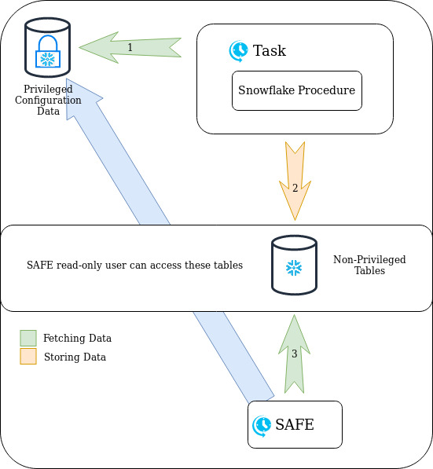
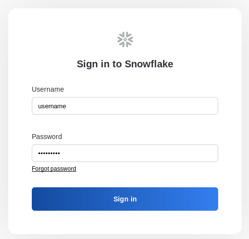
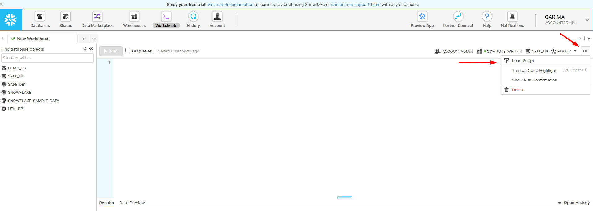
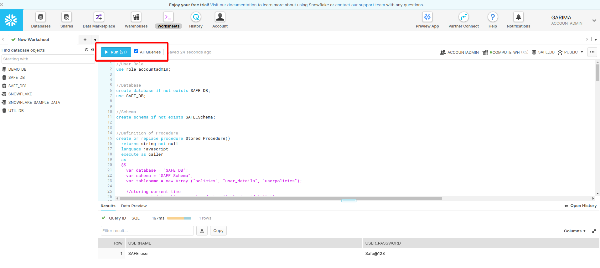
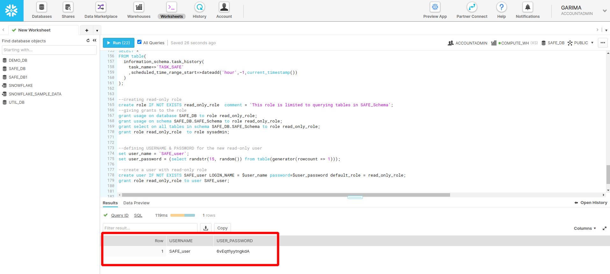

# Snowflake

## Description

Snowflake only allows ACCOUNTADMIN users to be able to execute commands on the behalf of any other user. From one perspective, this is a very useful feature, but from an auditor's perspective it makes their life a little bit complex as they don't want to use highest privileges for their audit but for snowflake they don't have a choice. It's already very difficult to find automation scripts to perform automated assessment of SaaS applications and if you create any script/tool to perform auditing of snowflake's configuration then executing scripts/tools on SaaS application with highest privileges is the biggest mistake.

We tried to implement a solution that offers a workaround to this situation by creating a stored procedure* in your snowflake account which will run with account admin privileges, will extract the required information from all users and store it in a separate schema which can be accessed by any non-privileged read only user.

## How it works

- Create a procedure to extract required information (This step will require ACCOUNTADMIN privileges)
- Store the information in separate tables
- Create a custom read-only role and provide access to the created tables
- Create a user and assign the custom read-only role
- Create a task in your Snowflake account to execute the procedure on a periodic basis (24/48 hours)

## How to Use

NOTE: Please use ACCOUNTADMIN Credentials for the below-mentioned steps 
**STEP 1**: Login to your Snowflake account with Account Admin privileges

**STEP 2**: Load the script on a fresh worksheet

**STEP 3**: Check "All Queries" and then Run

**STEP 4**: After execution of the script is complete, you username and password will be displayed on the screen

